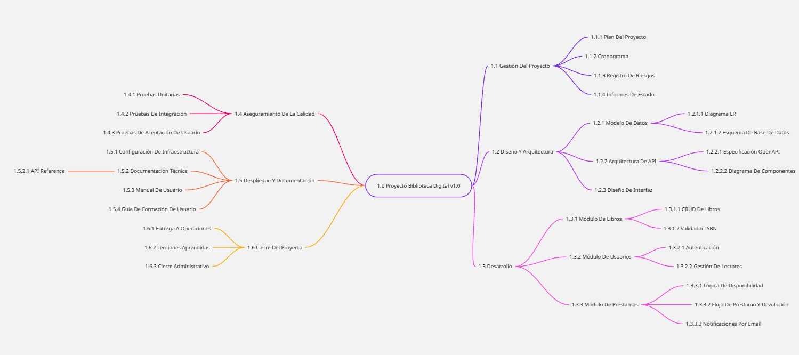

# 🌳 Estructura de Desglose del Trabajo (EDT/WBS)

## Proyecto: Biblioteca Digital v1.0

### 📊 Diagrama Visual

### 📋 Detalle por Nivel

#### 1.1 Gestión del Proyecto
- **1.1.1** Plan del Proyecto
- **1.1.2** Cronograma
- **1.1.3** Registro de Riesgos
- **1.1.4** Informes de Estado

#### 1.2 Diseño y Arquitectura
- **1.2.1** Modelo de Datos
  - **1.2.1.1** Diagrama Entidad-Relación
  - **1.2.1.2** Esquema de Base de Datos
- **1.2.2** Arquitectura de API
  - **1.2.2.1** Especificación OpenAPI
  - **1.2.2.2** Diagrama de Componentes
- **1.2.3** Diseño de Interfaz

#### 1.3 Desarrollo
- **1.3.1** Módulo de Libros
  - **1.3.1.1** CRUD de Libros
  - **1.3.1.2** Validador ISBN
- **1.3.2** Módulo de Usuarios
  - **1.3.2.1** Autenticación
  - **1.3.2.2** Gestión de Lectores
- **1.3.3** Módulo de Préstamos
  - **1.3.3.1** Lógica de Disponibilidad
  - **1.3.3.2** Flujo de Préstamo/Devolución
  - **1.3.3.3** Notificaciones por Email

#### 1.4 Aseguramiento de la Calidad
- **1.4.1** Pruebas Unitarias
- **1.4.2** Pruebas de Integración
- **1.4.3** Pruebas de Aceptación de Usuario

#### 1.5 Despliegue y Documentación
- **1.5.1** Configuración de Infraestructura
- **1.5.2** Documentación Técnica
- **1.5.3** Manual de Usuario
- **1.5.4** Guía de Formación de Usuario

#### 1.6 Cierre del Proyecto
- **1.6.1** Entrega a Operaciones
- **1.6.2** Lecciones Aprendidas
- **1.6.3** Cierre Administrativo

### 📝 Metodología
- Herramienta utilizada: Miro con Miro Assist
- Tipo de estructura: EDT/WBS jerárquica
- Fecha de creación: Mayo 2026
- Owner: [Tu nombre]

### ✅ Verificación
La EDT ha sido elaborada siguiendo la regla del 100%, incluyendo todos los entregables principales del proyecto y su descomposición en paquetes de trabajo estimables.
